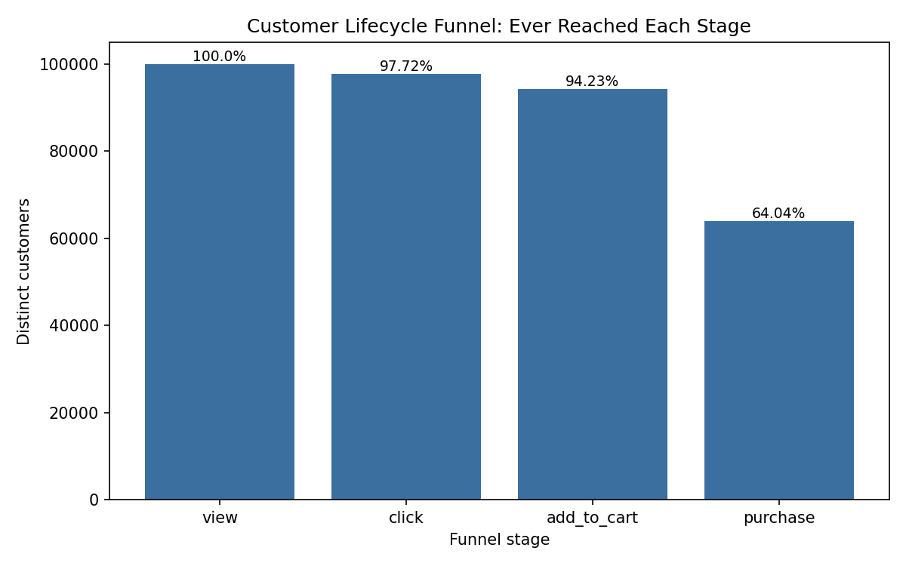
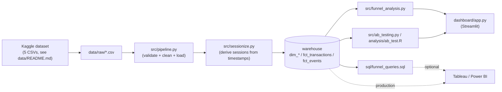
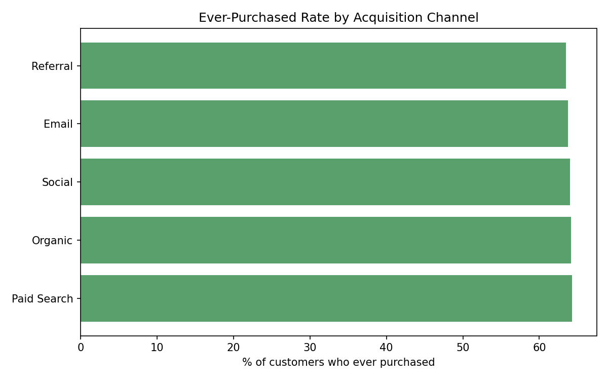

# Marketing Funnel & Experiment Analytics


End-to-end analytics platform on a real, public e-commerce dataset: builds
a customer conversion funnel, measures where customers drop off, and
evaluates a 3-arm onboarding/checkout experiment (Control / Variant_A /
Variant_B) — including a hard look at two real data-quality issues in the
source data that would have quietly produced a wrong analysis if ignored.

Built by **[Rohith Sure](https://github.com/rohithsure2000)** — Data
Analyst / Data Scientist (MS Data Science, Stevens Institute of Technology).

**Live demo:** _add your Streamlit Community Cloud link here once deployed
— see "Deploying the live demo" below_

## Skills demonstrated

- **SQL** — schema design, window functions, multi-table joins (`sql/`)
- **Statistical testing** — chi-square, two-proportion z-tests with a
  Bonferroni correction, and a customer-clustered bootstrap for a
  pseudo-replication check (`src/ab_testing.py`)
- **Data quality diagnosis** — caught and worked around two real issues
  in the source data instead of taking column names at face value (see
  below)
- **ETL / pipeline design** — validation, cleaning, and idempotent
  loading (`src/pipeline.py`)
- **Python** — pandas, NumPy, SciPy, Matplotlib, Plotly
- **Dashboarding** — interactive Streamlit app with a live/demo-mode
  fallback (`dashboard/app.py`)
- **R** — an equivalent implementation of the core statistical test
  (`analysis/ab_test.R`)

## Quick look



| | |
|---|---:|
| Customers analyzed | 99,997 |
| Ever purchased | 64,035 (64.0%) |
| Biggest drop-off | Cart → purchase (32.0%) |
| Avg. revenue / converted customer | $146.31 |
| Best experiment arm | Variant_B, **+1.56pp** over Control (p < 0.0001) |

Full breakdown, methodology, and the two data-quality findings that shaped
this analysis are below.

## The data

**Marketing & E-Commerce Analytics Dataset** by Geetha Sagar Bonthu,
[on Kaggle](https://www.kaggle.com/datasets/geethasagarbonthu/marketing-and-e-commerce-analytics-dataset)
(CC0, public domain). 100,000 customers, 2,000 products, 50 campaigns,
103,127 transactions, and 2,000,000 behavioral events (view / click /
add_to_cart / bounce / purchase) across 2021–2023.

The raw CSVs aren't committed to this repo (`events.csv` alone is
~180MB) — see [`data/README.md`](data/README.md) for the download link,
citation, and setup steps.

## Two data-quality findings that shaped this project

Both of these were caught by checking the data rather than assuming it
behaved the way its column names suggested — worth reading since they
directly determined how the funnel and the experiment are analyzed below.

**1. `session_id` isn't a real visit identifier.** 84% of session_id
values are shared across *multiple different customers*, sometimes years
apart. I tried deriving real sessions from timestamps instead (a standard
technique: a new session starts after a 30-minute gap in a customer's
activity — see `src/sessionize.py`), and found the data doesn't actually
support that either: **the median gap between a customer's consecutive
events is 36 days**, and only 0.04% of gaps are under 30 minutes. There's
no visit-clustered behavior to recover here. So instead of forcing a
session-based funnel the data can't support, this project measures a
**customer lifecycle funnel** — across a customer's entire history, did
they ever reach each stage — which is a standard and honest way to frame
a funnel when session data isn't trustworthy.

**2. `experiment_group` is assigned per *event*, not per *customer*.**
99.96% of customers show more than one experiment group across their
event history, so it can't be read as a traditional sticky A/B cohort.
Rather than either ignoring this or discarding the field, this project
tests it at the event level (the unit the data actually supports) and then
cross-checks that result with a **customer-clustered bootstrap** —
resampling customers, not events, so any within-customer correlation is
preserved rather than assumed away. The two approaches agree closely,
which is real evidence the effect isn't a pseudo-replication artifact.

## Architecture



The warehouse defaults to a local **SQLite** file so the whole thing runs
with zero setup beyond downloading the CSVs. Swap `DB_BACKEND=snowflake`
and set the `SNOWFLAKE_*` variables in `.env` to point the exact same
pipeline and queries at a real Snowflake warehouse — no code changes
required (see `src/db.py`).

## Results (from this repo's pipeline, run against the real dataset)

### Customer lifecycle funnel

| Stage | Customers reached | % of total | Step-over-step drop |
|---|---:|---:|---:|
| Viewed a product | 99,997 | 100.0% | — |
| Clicked | 97,725 | 97.7% | 2.3% |
| Added to cart | 94,228 | 94.2% | 3.6% |
| **Purchased** | **64,035** | **64.0%** | **32.0%** |

Bounce rate (share of all events that are `bounce`): **9.5%**. Average
lifetime revenue per converted customer: **$146.31**. The steepest
drop-off by far is cart → purchase — nearly a third of customers who add
something to their cart never complete a purchase.



Channel doesn't differentiate much here (63.5%–64.3% across all five
acquisition channels) — a genuinely flat result, not a rounding artifact.

### Experiment: Control vs. Variant_A vs. Variant_B

| Group | Events | Purchase rate |
|---|---:|---:|
| Control | 1,198,404 | 4.74% |
| Variant_A | 401,413 | 5.24% |
| Variant_B | 400,183 | 6.30% |

3-group chi-square test: **χ² = 1,499.9, p < 0.0001**. Pairwise
(Bonferroni-corrected α = 0.0167): all three pairs differ significantly,
with Variant_B showing the largest lift over Control (**+1.56 percentage
points**, p < 0.0001).

**Customer-clustered bootstrap** (2,000 resamples, robustness check):

| Comparison | Median lift | 95% CI |
|---|---:|---:|
| Variant_A vs Control | +0.50 pp | [0.42, 0.58] |
| Variant_B vs Control | +1.56 pp | [1.48, 1.64] |

The bootstrap CIs closely match the naive event-level test, which is why
the headline result is reported with reasonable confidence despite the
per-event assignment issue.

## Tech stack

Python (pandas, NumPy, SciPy, Matplotlib, Plotly, Streamlit) · SQL
(Snowflake-compatible, SQLite for local dev) · R (equivalent core test) ·
Docker · GitHub Actions CI

## Project structure

```
funnel-analytics-platform/
├── data/
│   ├── README.md                 # dataset source, citation, download steps
│   ├── raw/                      # place the 5 downloaded CSVs here (gitignored)
│   └── processed/                # SQLite warehouse (gitignored)
├── sql/
│   ├── schema.sql                 # warehouse DDL
│   └── funnel_queries.sql         # example analytical SQL
├── src/
│   ├── db.py                      # sqlite/snowflake connection helper
│   ├── pipeline.py                 # ETL: validate + clean + load
│   ├── sessionize.py                # derive real sessions from timestamps
│   ├── funnel_analysis.py            # customer lifecycle funnel + charts
│   ├── ab_testing.py                 # 3-group test + clustered bootstrap
│   └── export_demo_data.py            # snapshot results for cloud deployment
├── analysis/
│   └── ab_test.R                      # R equivalent of the core test
├── dashboard/
│   ├── app.py                          # Streamlit dashboard (live + demo mode)
│   └── demo_data/                       # precomputed results for cloud deployment
├── tests/
│   ├── test_sessionize.py
│   ├── test_funnel_analysis.py
│   └── test_ab_testing.py
├── reports/figures/                     # generated PNG charts
├── .github/workflows/ci.yml              # test-on-push CI
├── Dockerfile
├── requirements.txt
├── .env.example
└── README.md
```

## Getting started

### Prerequisites
- Python 3.11+
- The dataset — see [`data/README.md`](data/README.md) for the download
  link and setup (not included in this repo)
- (optional) Docker
- (optional) R with the `DBI` and `RSQLite` packages, if you want to run
  `analysis/ab_test.R`

### Setup

```bash
git clone https://github.com/rohithsure2000/funnel-analytics-platform.git
cd funnel-analytics-platform
python -m venv venv && source venv/bin/activate   # optional but recommended
pip install -r requirements.txt
cp .env.example .env   # defaults to local SQLite, no edits needed

# Download the dataset (see data/README.md) and place the 5 CSVs in data/raw/
```

### Run the pipeline

```bash
python -m src.pipeline           # clean, sessionize, and load into the warehouse
python -m src.sessionize         # (optional) sanity-check the session lengths
python -m src.funnel_analysis    # prints the funnel table, saves charts
python -m src.ab_testing         # prints the experiment results
python -m src.export_demo_data   # (optional) refresh dashboard/demo_data/ for cloud deployment
# or, equivalently, the core test in R:
Rscript analysis/ab_test.R data/processed/warehouse.db
```

### Run the dashboard

```bash
streamlit run dashboard/app.py
```
If `data/processed/warehouse.db` exists (i.e. you've run the pipeline),
the dashboard queries it live. Otherwise it automatically falls back to
the precomputed results in `dashboard/demo_data/` and shows a banner
saying so — this is what makes the cloud deployment below possible
without bundling the real ~200MB dataset.

### Deploying the live demo

Since `dashboard/app.py` falls back to `dashboard/demo_data/` when there's
no local warehouse, it can be deployed as-is to
[Streamlit Community Cloud](https://streamlit.io/cloud) (free) without
needing the real dataset present in the cloud environment:

1. Push this repo to GitHub (steps below, if not done yet).
2. Go to share.streamlit.io, sign in with GitHub, click "New app."
3. Point it at this repo, branch `main`, file path `dashboard/app.py`.
4. Deploy. It'll show the demo-mode banner and the precomputed real results.
5. Copy the resulting URL into the "Live demo" line at the top of this README.

### Run with Docker

```bash
docker build -t funnel-analytics .
docker run -p 8501:8501 -v $(pwd)/data/raw:/app/data/raw funnel-analytics
# then open http://localhost:8501
```

### Run the tests

```bash
pytest -v
```
Tests use small hand-crafted fixtures, not the real dataset, so they run
without downloading anything.

### Query it directly

Once the pipeline has run, `data/processed/warehouse.db` is a plain SQLite
file — open it with any SQLite client and run the queries in
`sql/funnel_queries.sql` directly, or adapt them for Snowflake.

## Connecting a real BI tool

This repo includes a Streamlit dashboard so it's runnable end-to-end
without a BI license. To point **Tableau** or **Power BI** at the same
data instead:
- Point either tool's SQLite/ODBC connector at `data/processed/warehouse.db`, or
- In production (`DB_BACKEND=snowflake`), connect Tableau/Power BI's native
  Snowflake connector to the same tables and reuse `sql/funnel_queries.sql`
  as the basis for calculated fields.

## Design decisions / what I'd add next

- **Funnel grain:** deliberately a lifecycle funnel, not a per-visit one
  — see "Two data-quality findings" above for why. A dataset with real
  session clustering would make a per-visit funnel (and the sessionization
  code already here) the better choice.
- **A/B test caveat:** the event-level p-values technically overstate
  precision slightly, since not every event is a fully independent draw
  in the strictest sense — that's exactly why the clustered bootstrap is
  included as a check rather than reporting the naive test alone.
- **Sample ratio check:** worth adding a formal SRM (sample ratio
  mismatch) test on the 60/20/20 split before trusting any lift number in
  a real deployment.
- **Revenue-weighted lift:** the current experiment analysis is on
  purchase *rate*; joining to `fct_transactions` for a revenue-per-event
  lift would be a natural next metric.
- **Alerting:** `.env.example` includes placeholders for a Slack
  webhook/email so a scheduled job could flag a funnel-stage regression
  automatically.

## Dataset citation

> Geetha Sagar Bonthu. (2025). Marketing & E-Commerce Analytics Dataset [Dataset]. Kaggle. https://doi.org/10.34740/KAGGLE/DSV/13964291

## License

Code in this repo: MIT — see [LICENSE](LICENSE). Dataset: CC0 (public
domain), per the Kaggle listing.
